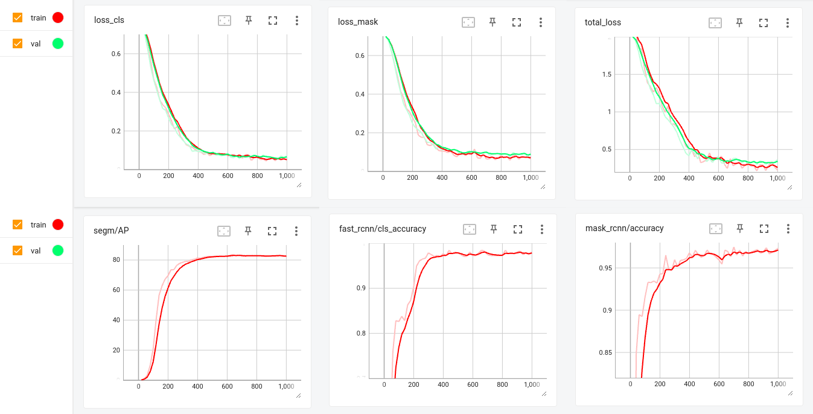
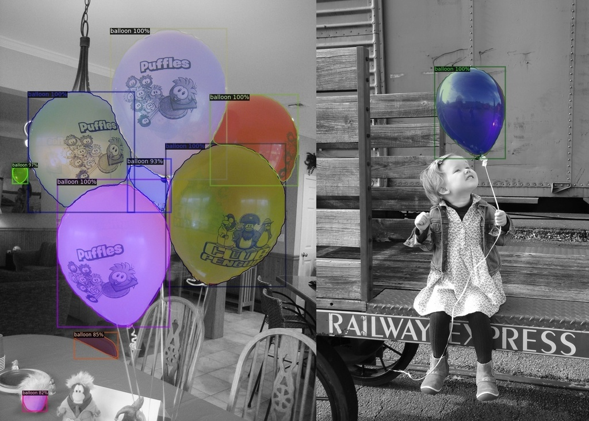

# detectron2_tutorial

Detectron2 from Facebook is an AI library with state-of-the-art detection and segmentation algorithms. While training AI algorithms, it is essential to keep an eye on training statistics. Unfortunately, some statistics, such as validation loss, is not currently provided but is possible by hacking the codebase (check references, please). Therefore, this tutorial is created to demonstrate the computation of training and validation loss using Detectron2.


## Dependencies
* Detectron2
* PyTorch


## Dataset
[Balloon segmentation dataset](https://github.com/matterport/Mask_RCNN/tree/master/samples/balloon): Please download it with the following command:
```console
$ wget https://github.com/matterport/Mask_RCNN/releases/download/v2.1/balloon_dataset.zip
```


## Training
```console
$ python3 main.py
```


## Statistics
```console
$ python3 -m tensorboard.main --logdir output
```


## Inference
```console
$ python3 inference.py
```


## Results
* Training Statistics

    

* Inference Results

    


## Issues (or Error Reporting) 
Please check [here](https://github.com/ravijo/detectron2_tutorial/issues) and create issues accordingly.


## References
1. https://github.com/facebookresearch/detectron2/issues/4368
1. https://github.com/facebookresearch/detectron2/issues/810
1. https://github.com/facebookresearch/detectron2#getting-started
1. https://github.com/matterport/Mask_RCNN/tree/master/samples/balloon
